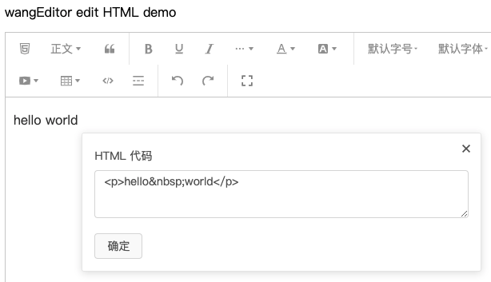

# wangEditor 编辑 HTML

[English Documentation](./README-en.md)

## 介绍

[wangEditor](https://www.wangeditor.com/) 编辑 HTML 插件。



## 安装

```shell
yarn add wangeditor-plugin-edit-html
```

## 使用

### 注册到编辑器

```js
import { Boot, IEditorConfig, IToolbarConfig } from '@wangeditor/editor'
import editHtmlModule from 'wangeditor-plugin-edit-html'

// 注册。要在创建编辑器之前注册，且只能注册一次，不可重复注册。
Boot.registerModule(editHtmlModule)
```

### 配置

```js
// 工具栏配置
const toolbarConfig: Partial<IToolbarConfig> = {
  insertKeys: {
    index: 0,
    keys: [
      'editHtml', // “编辑 HTML”菜单
    ],
  },

  // 其他...
}
```

然后创建编辑器和工具栏，会用到 `editorConfig` 和 `toolbarConfig` 。具体查看 wangEditor 文档。

## 其他

支持 i18n 多语言
